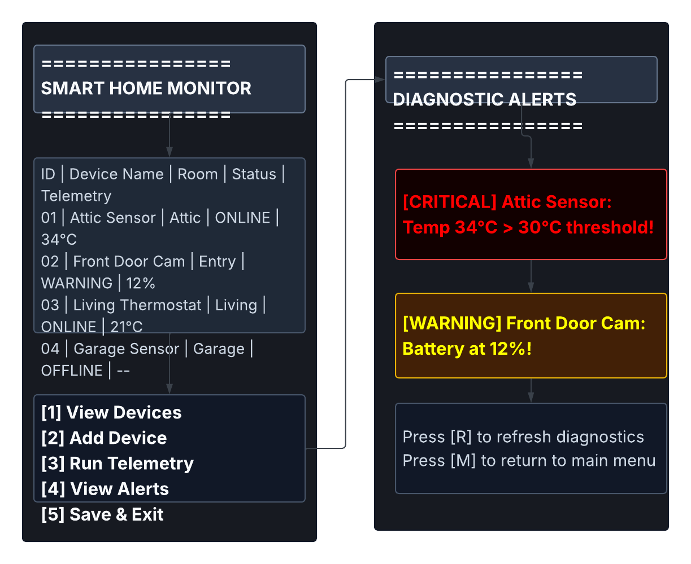

# Smart Home Device Monitor

A C#/.NET console application that reads device telemetry, manages smart home hardware, and logs diagnostic alerts.

## Features
- **Device Management:** Load and update device states from `devices.json`.
- **Telemetry Simulation:** Generate random temperature and battery updates.
- **Diagnostic Logging:** Trigger critical alerts when temperature or battery thresholds are breached.

## UI Mockups & System Workflow
